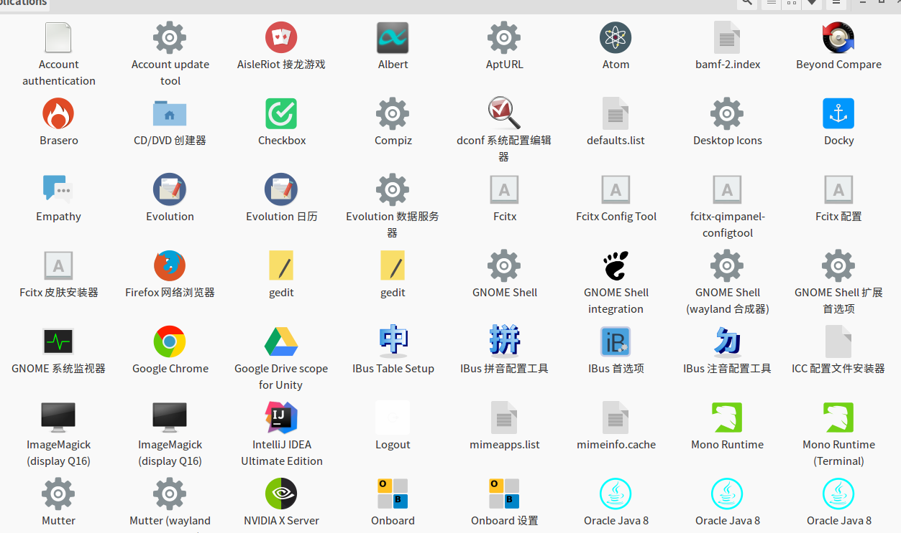

# ubuntu 下创建桌面快捷方式
* 基本概念
> Linux 系统中的Desktop Entry 文件以desktop为后缀名。Desktop Entry 文件是 Linux 桌面系统中用于描述程序启动配置信息的文件。
进入/usr/share/applications 目录，可见如下图所示的各类软件图标
如下图所示

其都是以desktop为结尾的文件格式

* 如何新建
> 1. `vim /usr/share/applications/eclipse.desktop`
> 2. 编辑eclipse.desktop
> `[Desktop Entry]
Encoding=UTF-8
Name=eclipse
Comment=Eclipse IDE
Exec=/usr/local/eclipse/eclipse  #根据软件的具体执行路径修改
Icon=/usr/local/eclipse/icon.xpm  #根据软件的具体执行路径修改
Terminal=false  #软件打开时是否启动终端
StartupNotify=false
Type=Application
Categories=Application;Development;`
> 3. 进入`/usr/share/applications` 将相应图标右键复制到桌面即可
